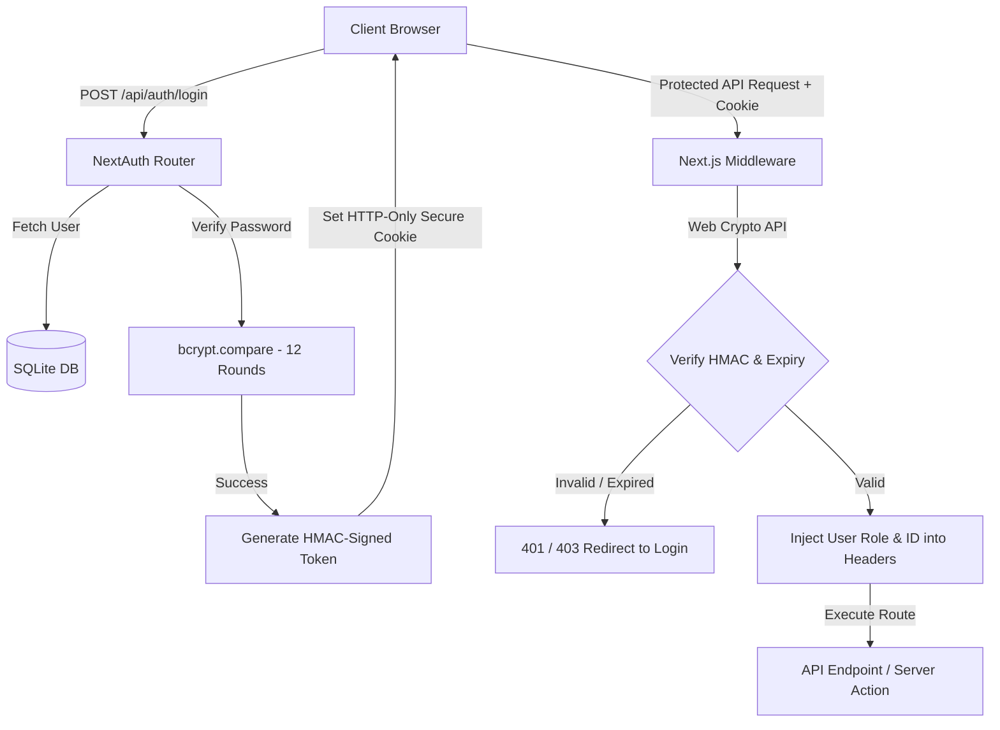
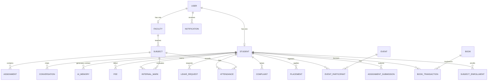
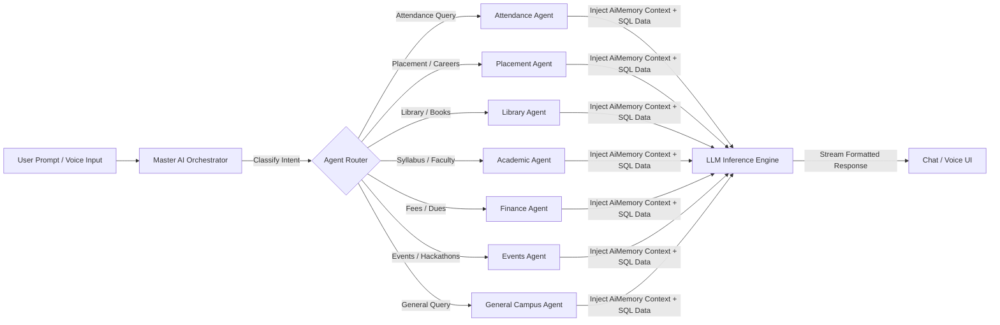
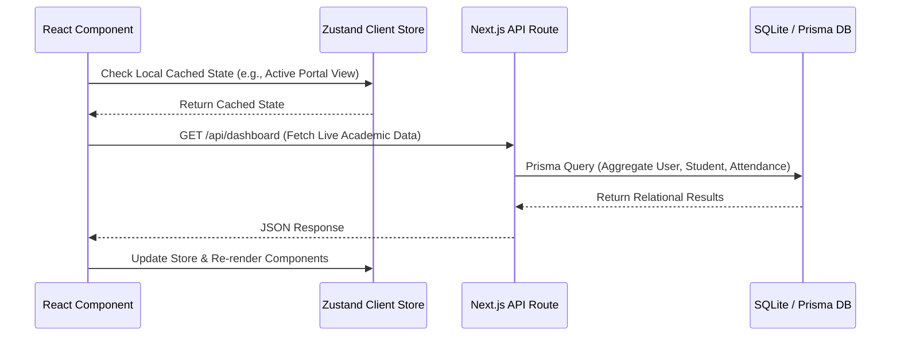

# 🎓 CampusOS AI v2.0 — Enterprise Edition
## Comprehensive Technical, Structural, and Functional Documentation

**Developed by Jai Samyukth Enterprises**  
*Document Version: 2.0.0-PRO | Target OS: Cross-Platform (Windows / Linux / macOS)*

---

## 📑 Table of Contents

1. [Executive Summary & Vision](#1-executive-summary--vision)
2. [Technical Documentation](#2-technical-documentation)
   - [2.1 Core Technology Stack](#21-core-technology-stack)
   - [2.2 Security & Authentication Architecture](#22-security--authentication-architecture)
   - [2.3 Database Engineering & Schema Design](#23-database-engineering--schema-design)
   - [2.4 RESTful API Topology & Reference](#24-restful-api-topology--reference)
   - [2.5 Multi-Agent AI Orchestration Architecture](#25-multi-agent-ai-orchestration-architecture)
3. [Structural Documentation](#3-structural-documentation)
   - [3.1 Codebase & Directory Tree](#31-codebase--directory-tree)
   - [3.2 Component Taxonomy & UI Modularization](#32-component-taxonomy--ui-modularization)
   - [3.3 State Management & Client-Server Data Flow](#33-state-management--client-server-data-flow)
   - [3.4 Script & Execution Lifecycle (`start.bat` & `package.json`)](#34-script--execution-lifecycle-startbat--packagejson)
4. [Functional Documentation](#4-functional-documentation)
   - [4.1 Student Portal (12 Modular Interfaces)](#41-student-portal-12-modular-interfaces)
   - [4.2 Faculty Portal (6 Classroom & Administrative Modules)](#42-faculty-portal-6-classroom--administrative-modules)
   - [4.3 Administrator Portal (11 Enterprise Control Modules)](#43-administrator-portal-11-enterprise-control-modules)
5. [Operational Guide & Troubleshooting](#5-operational-guide--troubleshooting)
   - [5.1 Prerequisite Setup & Installation](#51-prerequisite-setup--installation)
   - [5.2 Default Credentials & Role Matrix](#52-default-credentials--role-matrix)
   - [5.3 Windows Execution Fixes (Why `start.bat` Failed & How It Was Fixed)](#53-windows-execution-fixes-why-startbat-failed--how-it-was-fixed)

---

## 1. Executive Summary & Vision

**CampusOS AI v2.0** is an enterprise-grade, AI-native Campus Operating System engineered to unify fragmented academic, administrative, and financial university services into a single, cohesive digital ecosystem. Designed with modern **glassmorphism UI aesthetics**, responsive layouts, and multi-agent AI orchestration, CampusOS replaces traditional static university portals with proactive, conversational, and automated experiences.

The system is structured around three dedicated, role-isolated portals:
- **Student Portal**: Empowering learners with real-time academic tracking, AI tutoring, career placement pipelines, library management, and custom automated IF-THEN workflows.
- **Faculty Portal**: Providing educators with streamlined attendance marking, assignment grading, classroom analytics, and AI assistant tools.
- **Administrator Portal**: Equipping institution leadership with campus-wide analytics, comprehensive entity CRUD controls, smart global search, broadcast notification engines, and AI playground experimentation suites.

---

## 2. Technical Documentation

### 2.1 Core Technology Stack

CampusOS AI v2.0 is built on the latest advancements in web architecture:

| Component Layer | Selected Technology | Technical Rationale |
| :--- | :--- | :--- |
| **App Framework** | **Next.js 16 (App Router)** | Provides React Server Components (RSC), optimized edge API routing, server-side rendering (SSR), and standalone production bundling. |
| **Language** | **TypeScript 5** | Enforces strict compile-time type safety across database schemas, API contracts, and frontend component props. |
| **UI Library** | **React 19** | Delivers concurrent rendering primitives, custom hooks, and seamless DOM updates. |
| **Styling Engine** | **Tailwind CSS 4 + shadcn/ui** | Utility-first styling combined with accessible, unstyled Radix UI primitives for premium glassmorphism, dark/light themes, and responsive design. |
| **State Management** | **Zustand 5** | Lightweight, boilerplate-free global state container handling client session state, UI view toggles, and notification caching. |
| **ORM & Database** | **Prisma ORM 6 + SQLite** | Type-safe query builder and migration engine backed by an embedded SQLite relational database (`custom.db`) for zero-configuration portability. |
| **Authentication** | **NextAuth.js v4 + Custom Edge HMAC** | Hybrid authentication pipeline leveraging bcrypt hashing and Web Crypto Edge-compatible HMAC token verification. |
| **AI SDK** | **z-ai-web-dev-sdk** | Dedicated LLM client interfacing with multi-agent orchestration prompts and streaming chat completions. |
| **Visualization** | **Recharts 2 & Framer Motion 12** | Declarative charting for academic GPA/attendance trends and GPU-accelerated micro-animations across interactive elements. |

---

### 2.2 Security & Authentication Architecture

Security is architected in multi-layered tiers to ensure complete isolation between students, faculty, and administrators:



#### Security Highlights:
1. **Password Encryption**: All user passwords are hashed using `bcrypt` with a salt factor of **12 rounds**, preventing brute-force and rainbow table attacks.
2. **Edge-Compatible HMAC Signing**: Tokens are cryptographically signed using the Web Crypto API (`HMAC-SHA256`) with a proprietary secret (`CAMPUOS_HMAC_SECRET`). This allows Next.js Edge Middleware to verify requests in sub-milliseconds without querying the database.
3. **Session Lifecycle**: Tokens have a strict **24-hour expiration** window. Session state is persisted via secure, HTTP-only cookies, shielding tokens from Cross-Site Scripting (XSS) exfiltration.
4. **Role-Based Access Control (RBAC)**: Middleware intercepts every route transition and API invocation, strictly validating that the authenticated user's role (`admin`, `faculty`, or `student`) matches the required tier of the target resource.
5. **Controlled Provisioning**: Self-registration is intentionally restricted. New accounts can only be provisioned by authenticated Administrators with valid `@JSE.com` organizational domain identities.

---

### 2.3 Database Engineering & Schema Design

The Prisma database schema defines **18 interconnected relational entities** capturing the full spectrum of university operations:



#### Detailed Entity Specifications:
- `User`: Core identity table containing email, hashed password, display name, system role (`student`, `faculty`, `admin`), avatar URL, and department.
- `Student`: Academic profile extending `User`, storing roll number (`CS2022001`), current semester, section, cumulative GPA (CGPA), hostel room assignment, guardian emergency contact details, JSON-encoded technical skills, and placement status (`seeking`, `placed`).
- `Faculty`: Academic staff profile extending `User`, storing department designation (`Professor`, `Assistant Professor`), office cabin location, and teaching assignments.
- `Subject`: Course catalog entity containing course code (`CS601`), course name, semester level, credit weighting, assigned faculty reference, and JSON-encoded weekly lecture schedule.
- `SubjectEnrollment`: Junction entity mapping students to enrolled courses per semester.
- `Attendance`: Daily class attendance logs recording student ID, subject ID, timestamp, and status (`present`, `absent`, `late`).
- `InternalMark`: Continuous assessment record storing student marks for Test 1, Test 2, Assignment 1, Assignment 2, total computed score, and maximum possible marks.
- `Assignment`: Task entity created by faculty, defining title, instructions, due date, and total evaluative marks.
- `AssignmentSubmission`: Student submission artifact containing upload timestamps, awarded marks, faculty feedback notes, and status (`pending`, `submitted`, `graded`).
- `Book` & `BookTransaction`: Library inventory monitoring book ISBN, shelf location, total vs available copies, and borrowing/return audit trails with automated fine calculation.
- `Placement`: Career tracking entity documenting student job applications, target company (`Google`, `Microsoft`), role, compensation package, interview milestones, and application status.
- `Event` & `EventParticipant`: Campus life module handling hackathons, workshops, and cultural seminars, tracking capacity, registration open/closed state, and student participation.
- `Complaint`: Campus maintenance ticket tracking grievance category (`room`, `mess`, `academic`), description, priority (`low`, `medium`, `high`), and resolution workflow status.
- `LeaveRequest`: Medical and personal leave tracking submitted by students, requiring formal faculty approval.
- `Fee`: Financial ledger tracking tuition, hostel, exam, and library fee obligations, due dates, payment completion timestamps, and receipt statuses.
- `AiMemory`: Intelligent context store recording user learning preferences, weak subject areas, career aspirations, and interaction style to personalize LLM responses.
- `Conversation`: Persistent chat history logging dialogue turns between students/faculty and specialized AI sub-agents.
- `Notification`: System-wide and targeted alerts alerting users to upcoming assignment deadlines, fee dues, interview schedules, and broadcast announcements.

---

### 2.4 RESTful API Topology & Reference

CampusOS exposes clean, RESTful JSON endpoints grouped by functional domain:

#### 🔐 Authentication Module (`/api/auth/*`)
- `POST /api/auth/login`: Authenticates email/password against bcrypt hashes, returns session cookie and JWT.
- `POST /api/auth/register`: Admin-only endpoint to provision new `@JSE.com` accounts and generate matching Student/Faculty profiles.
- `GET /api/auth/session-info`: Validates current HTTP cookie and returns sanitized user profile metadata.
- `GET /api/auth/users`: Administrative list of all registered system accounts.

#### 🎓 Student Services Module (`/api/*`)
- `GET /api/dashboard`: Aggregates student CGPA, attendance percentage, active library borrowings, pending assignments, and upcoming event counts into a single JSON payload.
- `GET /api/attendance`: Retrieves chronological attendance records filtered by semester or subject.
- `GET /api/academic`: Returns student enrollment list, syllabus breakdown, and internal marks.
- `GET /api/exams`: Delivers semester exam timetables, seating room assignments, and published grade results.
- `GET /api/placement`: Fetches active company recruitment drives, eligibility criteria, and personal application statuses.
- `GET /api/library`: Searches book inventory by keyword/category and returns personal active loans and fine histories.
- `GET /api/hostel`: Returns hostel room assignment, roommate details, warden contacts, and personal maintenance complaints.
- `GET /api/finance`: Lists pending and completed fee invoices with payment gateway simulation tokens.
- `GET /api/events`: Displays campus event calendar, hackathon details, and allows one-click participation registration.
- `GET /api/notifications`: Retrieves unread alerts and supports marking notifications as read.
- `GET /api/profile` & `PATCH /api/profile`: Reads and updates editable student profile fields (skills, phone, guardian info).
- `GET /api/ai-memory`: Returns recorded AI memories and learning context profiles.
- `POST /api/chat`: Streams real-time conversational responses from the AI Multi-Agent Orchestrator.

#### 👨‍🏫 Faculty Services Module (`/api/faculty/*`)
- `GET /api/faculty`: Lists all teaching faculty across departments.
- `GET /api/faculty/[id]/dashboard`: Delivers faculty daily schedule, class rosters, and grading backlogs.
- `GET /api/faculty/[id]/attendance`: POST/PATCH endpoints for batch-marking student class attendance.
- `GET /api/faculty/[id]/assignments`: CRUD operations for publishing class assignments.
- `PATCH /api/faculty/[id]/assignments/[aid]/grade`: Awards numerical grades and written feedback to student submissions.
- `GET /api/faculty/[id]/classes`: Returns enrolled students and performance distribution charts per assigned subject.

#### 🛡️ Administration Module (`/api/admin/*`)
- `GET /api/admin`: Enterprise dashboard stats (total students, faculty, system uptime, revenue collection, active complaints).
- `GET /api/admin/students` & `PATCH /api/admin/students/[id]`: Full management of student profiles, academic standing, and disciplinary flags.
- `GET /api/admin/faculty` & `PATCH /api/admin/faculty/[id]`: Full management of faculty designations, departments, and cabin allocations.
- `GET /api/admin/subjects`: Course catalog creation, scheduling, and faculty assignment.
- `GET /api/admin/complaints` & `PATCH /api/admin/complaints/[id]`: Triage center for updating maintenance ticket priorities and statuses.
- `GET /api/admin/search`: Global multi-entity search across students, faculty, books, and courses.
- `POST /api/admin/notifications/broadcast`: Triggers system-wide alerts broadcast to all active user dashboards.

---

### 2.5 Multi-Agent AI Orchestration Architecture

Unlike standard chatbots that rely on static system prompts, CampusOS implements a **Master AI Orchestrator** pattern that intelligently routes queries to domain-specialized sub-agents:



#### Specialized Sub-Agent Capabilities:
1. **Attendance Agent**: Queries real-time attendance logs, calculates required attendance percentages to maintain the 75% university threshold, and predicts attendance status if future classes are missed.
2. **Placement Agent**: Accesses corporate recruitment criteria, reviews student skill sets (from `skills` field), recommends resume improvements, and simulates mock technical interview questions.
3. **Library Agent**: Checks real-time database book availability, locates shelf positions (`A3-12`), and suggests supplementary reading based on enrolled courses.
4. **Academic Agent**: Explains complex syllabus topics, retrieves faculty office hours, and analyzes internal mark distributions to identify areas needing academic intervention.
5. **Finance Agent**: Summarizes outstanding tuition and fee invoices, explains scholarship deductions, and details payment due dates without exposing sensitive billing logic.
6. **Events Agent**: Highlights upcoming hackathons, tech talks, and cultural fests, providing direct registration links and venue directions.
7. **Voice Assistant Integration**: Converts microphone audio into text transcripts, routes through the Master Orchestrator, and returns text accompanied by visual waveform animations.

---

## 3. Structural Documentation

### 3.1 Codebase & Directory Tree

The repository is organized according to Next.js App Router best practices, enforcing strict separation between database schemas, frontend components, state stores, and API backend routes:

```
d:\CampusOS\
├── .env                       # Environment configuration secrets
├── start.bat                  # Automated 7-step Windows launch script
├── package.json               # Project metadata and cross-platform npm scripts
├── tsconfig.json              # TypeScript compiler configuration
├── tailwind.config.ts         # Tailwind CSS styling tokens and custom theme extensions
├── middleware.ts              # Edge-compatible NextAuth route protection middleware
├── db/
│   └── custom.db              # SQLite database file containing operational data
├── prisma/
│   ├── schema.prisma          # Database schema definition (18 models)
│   └── seed.ts                # Master seeder generating demo students, faculty, and records
├── public/                    # Static image assets, icons, and logo graphics
└── src/
    ├── app/
    │   ├── globals.css        # Core design system tokens, CSS variables, and keyframe animations
    │   ├── layout.tsx         # Root HTML layout wrapping providers and metadata
    │   ├── page.tsx           # Main application entry point routing to role-based dashboards
    │   ├── login/
    │   │   └── page.tsx       # Glassmorphism login authentication interface
    │   └── api/               # Serverless backend API route handlers
    │       ├── academic/      # Academic syllabus and marks endpoints
    │       ├── admin/         # Enterprise administrative endpoints
    │       ├── ai-memory/     # AI context persistence endpoints
    │       ├── attendance/    # Attendance tracking endpoints
    │       ├── auth/          # Authentication, session, and registration endpoints
    │       ├── chat/          # LLM streaming chat completion endpoint
    │       ├── dashboard/     # Student dashboard aggregation endpoint
    │       ├── events/        # Campus event endpoints
    │       ├── exams/         # Exam schedule and result endpoints
    │       ├── faculty/       # Faculty management and grading endpoints
    │       ├── finance/       # Billing and fee ledger endpoints
    │       ├── hostel/        # Hostel accommodation and complaint endpoints
    │       ├── library/       # Library catalog and borrowing endpoints
    │       ├── notifications/ # Notification alert endpoints
    │       ├── placement/     # Career recruitment endpoints
    │       └── profile/       # User profile update endpoints
    ├── components/
    │   ├── auth/              # Session provider and authentication wrappers
    │   ├── campus/            # 38 core application components and portal interfaces
    │   │   ├── AcademicSection.tsx      # Student course & marks view
    │   │   ├── AdminAIPlayground.tsx    # Admin prompt testing workbench
    │   │   ├── AdminAutomationBuilder.tsx # Admin workflow automation builder
    │   │   ├── AdminComplaintManager.tsx  # Maintenance triage desk
    │   │   ├── AdminCourseManager.tsx     # Course catalog editor
    │   │   ├── AdminFacultyManager.tsx    # Faculty CRUD manager
    │   │   ├── AdminKnowledgeBase.tsx     # AI knowledge base manager
    │   │   ├── AdminNotificationBroadcaster.tsx # Broadcast notification tool
    │   │   ├── AdminPortal.tsx            # Main administrator workspace
    │   │   ├── AdminSmartSearch.tsx       # Global multi-entity search bar
    │   │   ├── AdminStudentManager.tsx    # Student directory & CRUD tool
    │   │   ├── AdminUserManager.tsx       # Account provisioning tool
    │   │   ├── AiMemorySection.tsx        # Personal AI memory manager
    │   │   ├── AttendanceSection.tsx      # Attendance tracker & trends
    │   │   ├── ChatPanel.tsx              # Conversational AI assistant drawer
    │   │   ├── CommandPalette.tsx         # Ctrl+K quick navigation modal
    │   │   ├── Dashboard.tsx              # Main student overview screen
    │   │   ├── EventsSection.tsx          # Campus event calendar & registration
    │   │   ├── ExamsSection.tsx           # Timetable & CGPA calculator
    │   │   ├── FacultyPortal.tsx          # Main faculty workspace & gradebook
    │   │   ├── FinanceSection.tsx         # Fee billing & invoice tracker
    │   │   ├── Header.tsx                 # Global top navigation bar
    │   │   ├── HostelSection.tsx          # Room assignment & ticket view
    │   │   ├── LibrarySection.tsx         # Book search & loan history
    │   │   ├── PlacementSection.tsx       # Career applications tracker
    │   │   ├── ProfileSection.tsx         # Student profile & resume editor
    │   │   ├── SettingsSection.tsx        # System preferences & themes
    │   │   ├── Sidebar.tsx                # Role-aware navigation sidebar
    │   │   ├── SplashScreen.tsx           # Initial branded JSE animation
    │   │   ├── ThemeToggle.tsx            # Dark/light mode switcher
    │   │   ├── VoiceAssistant.tsx         # Audio speech-to-text widget
    │   │   ├── WidgetCard.tsx             # Reusable glassmorphism card container
    │   │   └── WorkflowSection.tsx        # Student IF-THEN rule creator
    │   └── ui/                # Unstyled shadcn/ui primitives (dialogs, tabs, tables)
    ├── hooks/                 # Reusable custom React hooks
    └── lib/                   # Core business logic and server utilities
        ├── auth.ts            # NextAuth options, session callbacks, and JWT handlers
        ├── db.ts              # Singleton Prisma client instance
        ├── proxy.ts           # Request forwarding utilities
        ├── store.ts           # Zustand global state definition
        └── utils.ts           # CSS class merging (`cn`) and formatting helpers
```

---

### 3.2 Component Taxonomy & UI Modularization

The frontend architecture follows atomic design principles and compositional hierarchy:

1. **Root Layout & Navigation Layer**:
   - `layout.tsx`: Wraps the entire application in NextAuth `SessionProvider`, theme providers, and global font definitions.
   - `Header.tsx` & `Sidebar.tsx`: Dynamically adjust navigation items based on the active user's role (`student` vs `faculty` vs `admin`), incorporating user avatars, unread notification badges, and theme toggles.
   - `CommandPalette.tsx`: Global keyboard interceptor (`Ctrl+K` / `Cmd+K`) allowing instant jumping between portals, search execution, and quick action invocation.

2. **Role-Isolated Portal Containers**:
   - `Dashboard.tsx`: Organizes student widgets into a responsive 12-column grid.
   - `FacultyPortal.tsx`: Encapsulates classroom management, tabulating class rosters, pending assignment evaluations, and attendance marking sheets.
   - `AdminPortal.tsx`: Houses administrative tabs, routing deep-link navigation between student management, course creation, and system automation builders.

3. **Domain Feature Sections (`/components/campus/*`)**:
   - Each academic domain is encapsulated in an autonomous component (e.g., `AttendanceSection.tsx`, `PlacementSection.tsx`, `LibrarySection.tsx`). These components handle their own data fetching, loading skeleton states, and optimistic UI updates.

4. **UI Primitive Library (`/components/ui/*`)**:
   - Built on Radix UI headless primitives and styled with Tailwind CSS, providing accessible dialogs, tooltips, dropdown menus, progress bars, and form inputs.

---

### 3.3 State Management & Client-Server Data Flow

CampusOS utilizes a hybrid state architecture:



- **Client Session State (`store.ts`)**: Zustand manages UI-level state, including active navigation tabs, drawer open/close states, notification banners, and cached user preferences. This avoids prop drilling across deep component trees.
- **Server Data Fetching**: Components use asynchronous fetch requests to Next.js API routes. Backend routes execute optimized Prisma queries against SQLite, leveraging database indexing on foreign keys (`userId`, `studentId`, `subjectId`).
- **Optimistic UI Updates**: When performing actions such as marking attendance or submitting complaints, the UI updates immediately in the client store while the background API request processes, ensuring a zero-latency feel.

---

### 3.4 Script & Execution Lifecycle (`start.bat` & `package.json`)

To ensure seamless execution on Windows environments without requiring manual terminal configuration, the project provides a robust automated script: `start.bat`.

#### Lifecycle Stages of `start.bat`:
1. **Prerequisite Detection**: Checks system `PATH` for `bun.exe` or `node.exe`/`npm.cmd`. Automatically assigns environment variables (`%RUNNER%`, `%INSTALLER%`, `%SEEDER%`, `%DEV_CMD%`) based on the detected package manager.
2. **Environment Configuration**: Inspects the root directory for `.env`. If absent, generates default configuration values pointing to `./db/custom.db`.
3. **Dependency Installation**: Executes `bun install` or `npm install` to download required node modules.
4. **Database Schema Application**: Invokes `prisma db push` to synchronize the SQLite database structure with `schema.prisma`.
5. **Client Generation**: Runs `prisma generate` to build type-safe TypeScript query bindings in `@prisma/client`.
6. **Data Seeding**: Executes `tsx prisma/seed.ts`, populating the database with institutional test data and administrative credentials.
7. **Server Launch**: Starts the Next.js development server on port **3000** and presents formatted access credentials in the command prompt.

---

## 4. Functional Documentation

### 4.1 Student Portal (12 Modular Interfaces)

When logged in as a student (e.g., `sam.kumar@JSE.com`), the interface unlocks 12 functional modules:

1. **Interactive Dashboard**: Displays real-time KPIs including CGPA (**8.72**), Overall Attendance (**88%**), Active Library Loans, and Pending Assignments. Includes visual progress rings and immediate action banners.
2. **Attendance Section**: Lists course-by-course attendance logs. Features an interactive **Attendance Predictor** where students can simulate the impact of missing upcoming lectures on their overall percentage.
3. **Placement Portal**: Displays active corporate recruitment drives (Google, Microsoft, Amazon). Allows students to track application phases (`Applied` $\rightarrow$ `Interview Scheduled` $\rightarrow$ `Offer`), review salary packages, and access AI-generated interview preparation guides.
4. **Library Section**: Interactive catalog search allowing filtering by category (Machine Learning, Operating Systems, Networking). Displays shelf location coordinates (`A3-12`), live copy availability, and calculates overdue borrowing fines.
5. **Academic Section**: Presents enrolled subject syllabi, credit weightings, teaching faculty contact cards, and continuous internal assessment scores (Test 1, Test 2, Assignments).
6. **Exams Section**: Publishes semester examination timetables, room seating arrangements, downloadable hall tickets, and features an interactive **CGPA Calculator** to model target grades.
7. **Hostel Section**: Details room assignments (`H4-207`), roommate profiles, warden emergency contacts, and allows submitting maintenance complaints (`AC not working`) with real-time status tracking.
8. **Finance Section**: Complete financial ledger itemizing tuition, hostel, exam, and library fees. Highlights paid receipts versus pending invoices with due dates.
9. **Events Section**: Campus life hub showcasing hackathons (`CodeStorm 2025`), technical workshops, and cultural festivals. One-click registration instantly reserves participant slots.
10. **AI Memory Manager**: Allows students to view and delete context memories stored by the AI (e.g., *"Struggles with probability"*, *"Prefers morning study sessions"*), giving users complete sovereignty over their AI learning profile.
11. **Workflow Automation Builder**: An intuitive IF-THEN rule builder where students can create custom triggers (e.g., *IF Attendance drops below 75% THEN send high-priority alert*, or *IF new assignment is posted THEN add to study planner*).
12. **Profile & Settings**: Profile editor for updating contact numbers, technical skills badges, guardian details, and customizing dark/light UI themes.

---

### 4.2 Faculty Portal (6 Classroom & Administrative Modules)

When logged in as faculty (e.g., `dr.sharma@JSE.com`), the interface transforms into an educator workstation:

1. **Faculty Dashboard**: Highlights daily teaching schedules, total enrolled students across assigned courses, pending assignment grading queues, and departmental announcements.
2. **My Classes**: Course management view showing detailed rosters of students enrolled in assigned subjects (`CS601 Machine Learning`, `CS605 Deep Learning`).
3. **Attendance Mark Sheet**: Fast-action attendance register allowing faculty to mark class rosters as `Present`, `Absent`, or `Late` in batch mode for specific lecture dates.
4. **Assignment Grading Desk**: Comprehensive grading interface where faculty publish new coursework, set due dates, review uploaded student submissions, award numerical marks, and enter constructive qualitative feedback.
5. **Student Directory & Analytics**: Performance monitoring tool allowing faculty to search student profiles, view cross-subject GPA distributions, and identify academically at-risk students requiring counseling.
6. **Weekly Timetable & Schedule**: Grid layout of teaching commitments, lecture hall allocations (`LH-201`, `Lab-301`), and designated office hours.

---

### 4.3 Administrator Portal (11 Enterprise Control Modules)

When logged in as an administrator (`admin@JSE.com`), the system grants full control over institutional data:

1. **Global KPI Overview**: Enterprise metrics tracking total student enrollment, active faculty, system uptime, total fee revenue collection, and open maintenance complaints.
2. **Student CRUD Manager**: Administrative directory supporting adding new students, updating roll numbers, adjusting CGPAs, modifying hostel allocations, and managing disciplinary statuses.
3. **Faculty CRUD Manager**: Staff administration tool for assigning faculty designations (`Professor`, `Associate Professor`), departmental affiliations, and office cabin locations.
4. **Course & Curriculum Manager**: Course catalog editor for creating new subject codes, assigning credit weights, setting lecture schedules, and mapping teaching faculty.
5. **Complaint Resolution Center**: Campus operations triage desk where administrators review hostel and mess grievances, assign priority tags (`high`, `medium`), and update completion statuses (`open` $\rightarrow$ `in_progress` $\rightarrow$ `resolved`).
6. **Notification Broadcaster**: Institutional messaging engine capable of pushing instant emergency alerts, fee reminders, or event announcements to specific student cohorts or campus-wide dashboards.
7. **Smart Search Engine**: Global cross-entity search bar indexing students by roll number, books by ISBN, faculty by name, and courses by code from a single unified query.
8. **AI Knowledge Base Manager**: Interface for ingesting, editing, and managing institutional policy documents, syllabus guidelines, and campus rules that feed into the AI Orchestrator's RAG (Retrieval-Augmented Generation) pipeline.
9. **Automation Workflow Builder**: Institutional rule builder for creating campus-wide administrative automations (e.g., auto-flagging students with fee defaults or generating monthly attendance summaries).
10. **AI Playground & Prompt Workbench**: Sandboxed testing environment where administrators can simulate multi-agent AI prompts, evaluate LLM latency, and refine agent routing logic before deployment.
11. **User Provisioning & Account Manager**: Secure identity creation desk where administrators generate new user credentials restricted to the `@JSE.com` domain.

---

## 5. Operational Guide & Troubleshooting

### 5.1 Prerequisite Setup & Installation

To run CampusOS AI v2.0 from scratch on a clean machine:

1. **Verify System Prerequisites**: Open your command prompt or terminal and ensure Node.js (v18+) or Bun is installed:
   ```cmd
   node -v
   npm -v
   :: OR
   bun -v
   ```
2. **Execute Startup Script**: Navigate to the project directory and run the automated Windows launcher:
   ```cmd
   start.bat
   ```
   *The batch file will automatically create `.env`, install node modules, apply database schemas, generate Prisma bindings, seed demo data, and launch the server.*
3. **Access Application**: Open a web browser and navigate to:
   **`http://localhost:3000`**

---

### 5.2 Default Credentials & Role Matrix

The demo database seeder (`prisma/seed.ts`) automatically provisions pre-configured accounts representing all three operational tiers:

| Role Tier | Login Email | Password | Assigned Identity & Profile Details |
| :--- | :--- | :--- | :--- |
| **System Admin** | `admin@JSE.com` | `Samyukth@2378` | **JSE Admin** — Full institutional access, user provisioning, global broadcasting. |
| **Student** | `sam.kumar@JSE.com` | `Student@2024` | **Sam Kumar** — Roll: `CS2022001`, Semester 6 Computer Science, CGPA: 8.72, Room: H4-207. |
| **Faculty** | `dr.sharma@JSE.com` | `Faculty@2024` | **Dr. Rajesh Sharma** — Professor of Computer Science, Cabin: Block A-201. |
| **Faculty** | `dr.patel@JSE.com` | `Faculty@2024` | **Dr. Anita Patel** — Associate Professor of Computer Science, Cabin: Block A-205. |
| **Faculty** | `dr.kumar@JSE.com` | `Faculty@2024` | **Dr. Vikram Kumar** — Assistant Professor of IT, Cabin: Block B-102. |

---

### 5.3 Windows Execution Fixes (Why `start.bat` Failed & How It Was Fixed)

During initial testing on Windows environments, executing `start.bat` resulted in the following critical failure:
```
[ERROR] Neither bun nor node.js found!
Please install one of the following: ...
```
Even when Node.js and npm were properly installed and verified in the system `PATH`.

#### The Root Cause Analysis (Three Distinct Bugs):

1. **Bug #1: Parse-Time Variable Expansion inside Parenthetical Blocks (`%ERRORLEVEL%`)**
   - **The Issue**: In standard Windows command batch scripts (`cmd.exe`), variable references enclosed in percent signs (such as `%ERRORLEVEL%`) inside compound parenthesized blocks (`if ... else (...)`) are expanded **at the exact moment the entire block is parsed into memory**, rather than dynamically during execution.
   - **The Failure**: Because `where bun` executed first and failed (returning exit code `1`), when `cmd.exe` parsed the outer `if ... else` block, it substituted `%ERRORLEVEL%` with `1` throughout the entire block structure. Consequently, even when `where node` ran inside the `else` branch and succeeded (exit code `0`), the subsequent verification check had already been statically expanded to `if 1 EQU 0`. The script jumped directly to the error handler, falsely reporting that neither runtime was installed.
   - **The Fix**: Removed nested compound blocks completely. Replaced syntax with sequential `if not errorlevel 1` checks paired with structured `goto :prereq_done` jumps. The `errorlevel` keyword evaluates runtime return codes dynamically without triggering static variable expansion.

2. **Bug #2: Premature Termination from Missing `call` Commands**
   - **The Issue**: In Windows Command Prompt, package manager executables (`npm`, `npx`, `bun`, `bunx`, `prisma`) are implemented as batch script wrappers (`.cmd` or `.bat`). When a batch script invokes another batch script without the `call` keyword, control is permanently transferred to the secondary script.
   - **The Failure**: When `start.bat` invoked `%INSTALLER%` (`npm install`) or `%RUNNER% run db:push`, `cmd.exe` handed execution over to `npm.cmd`. As soon as dependency installation finished, the terminal window terminated immediately, completely skipping steps 4, 5, 6, and 7 (database setup and server launch).
   - **The Fix**: Preended the explicit `call` keyword before all package manager invocations (`call %INSTALLER%`, `call %RUNNER% run db:push`, `call %RUNNER% run db:generate`, `call %SEEDER%`, and `call %DEV_CMD%`), forcing control to return to `start.bat` upon command completion.

3. **Bug #3: Missing Unix Utility (`tee`) in `package.json` Scripts**
   - **The Issue**: The npm `dev` and `start` scripts in `package.json` were configured with Unix piping commands: `"dev": "next dev -p 3000 2>&1 | tee dev.log"`.
   - **The Failure**: On standard Windows cmd/PowerShell installations without POSIX utilities installed, executing `npm run dev` caused the shell to crash with the error: `'tee' is not recognized as an internal or external command, operable program or batch file`, breaking the local development server.
   - **The Fix**: Updated `package.json` to strip Unix-specific piping, setting clean cross-platform execution strings: `"dev": "next dev -p 3000"` and `"start": "NODE_ENV=production next start -p 3000"`.

---
*End of Documentation — CampusOS AI v2.0 Enterprise Edition*
